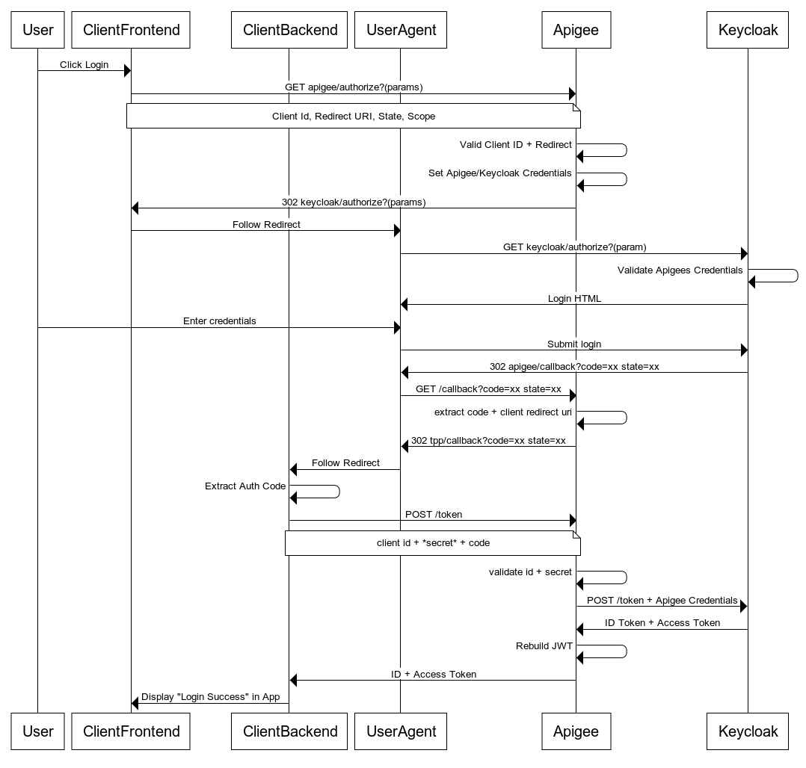

Identity Example for Keycloak
---

## Flow



## Proxy Code

Proxy Code can be found in the `apiproxy` directory.

## Integration Tests

Integration tests are built using the [Apickli](https://github.com/apickli/apickli) framework.
They can be found in the `test` directory.

## Deployment

Deployment is done using [apigeetool](https://www.npmjs.com/package/apigeetool) via npm [scripts](https://docs.npmjs.com/misc/scripts). 

To install dependencies:
```
npm install
```

To setup credentials:
```
export APIGEE_USER=someone@example.com
export APIGEE_PASS=xxx
```

To deploy:
```
npm run deploy -- -o org-name -e test
```

To test:
```
npm test -- -o org-name -e test
```

## Continuous Integration

A simple `Jenkinsfile` has been created to demonstrate automation. 

To import this into your own Jenkins:
- Ensure that Node JS is installed on the Jenkins instance
- Create a *Pipeline* Job
- Tick *This project is parameterised* and provide the parameters `Org` and `Env`.
- Set *Pipeline* > Definition to `Pipeline script from SCM`
- Set SCM to point to your Git Repository

In addition you must add Apigee credentials to push from Jenkins.

- Navigate to the *Credentials* page
- Add a `secret text` entry for `jenkins-apigee-username` with the email address
- Add a `secret text` entry for `jenkins-apigee-password` with the password

The job can now be run.
